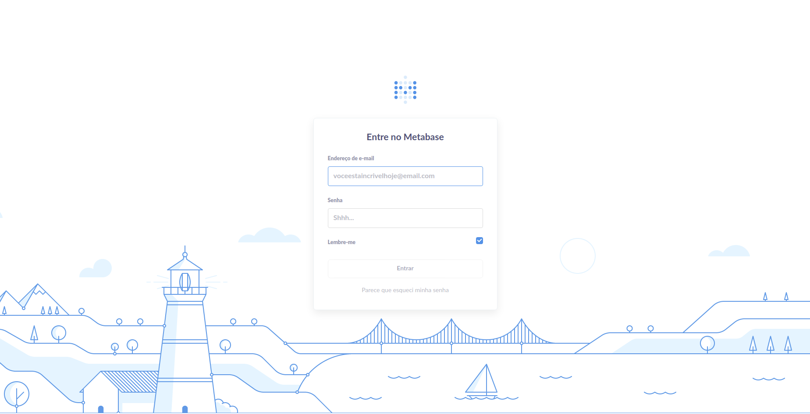
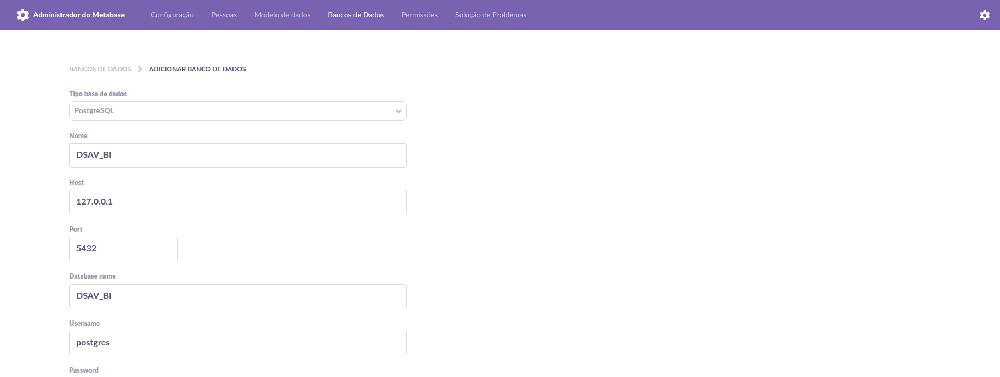
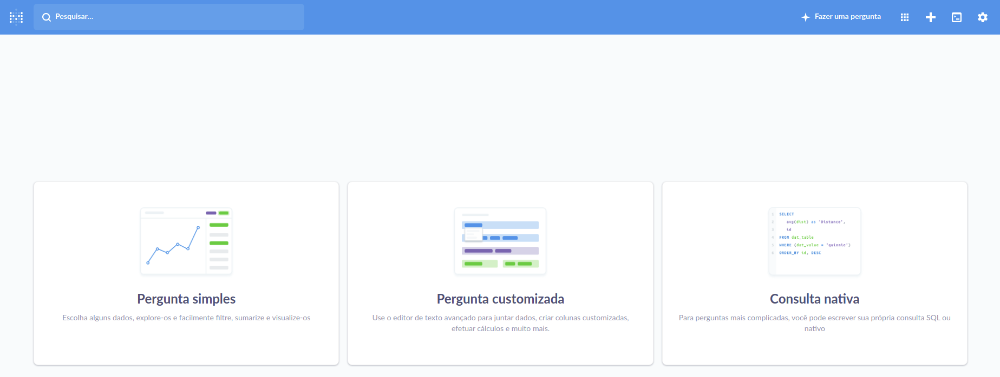
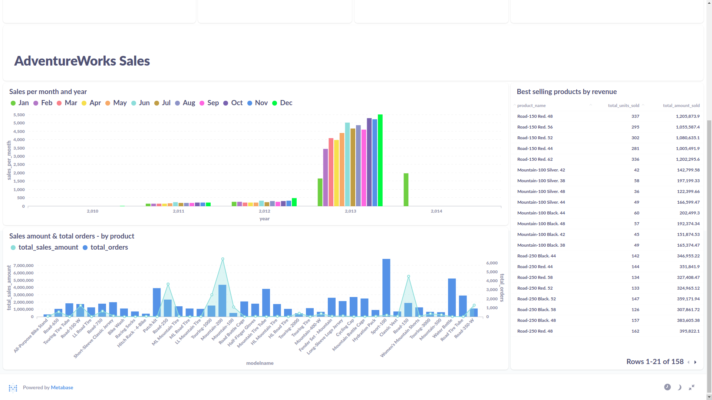

# Dashboard - Metabase

**Content**

<!-- TOC -->

- [Purpose](#purpose)
- [PostgreSQL](#postgresql)
- [Metabase](#metabase)

<!-- TOC -->

## Purpose

Create a dashboard in Metabase using a sample of the [AdventureWorks](https://dataedo.com/download/AdventureWorks.pdf) data.

## PostgreSQL

Extract the file:

```file
AdventureWorkDW_extract_NEW.csv.zip
```

Change the decimals of the numerical data from "," to "." and the separator from ";" to ",".

```example
123,45;678,90 ➡️ 123.45,678.90 
```

In the PostgreSQL tool run the file:

```file
BI.sql
```

## Metabase

[Documentation](https://www.metabase.com/docs/latest/)

```bash
~/Metabase$ java -jar metabase.jar
```

```browser
//localhost:3000
```


<br>
<br>

1 - Connect PostgreSQL to Metabase.



<br>
<br>

2 - Create questions



<br>
<br>

```file
metabase_questions.txt
```

<br>

3 - Final work

Access [dashboard](http://localhost:3000/public/dashboard/6f4b2e84-287a-482c-a6d4-91349a8037c3).



<br>

## Made with

<p>


</p>

## Author

[](https://www.linkedin.com/in/pathilink/)

## License

[](https://opensource.org/licenses/MIT)
